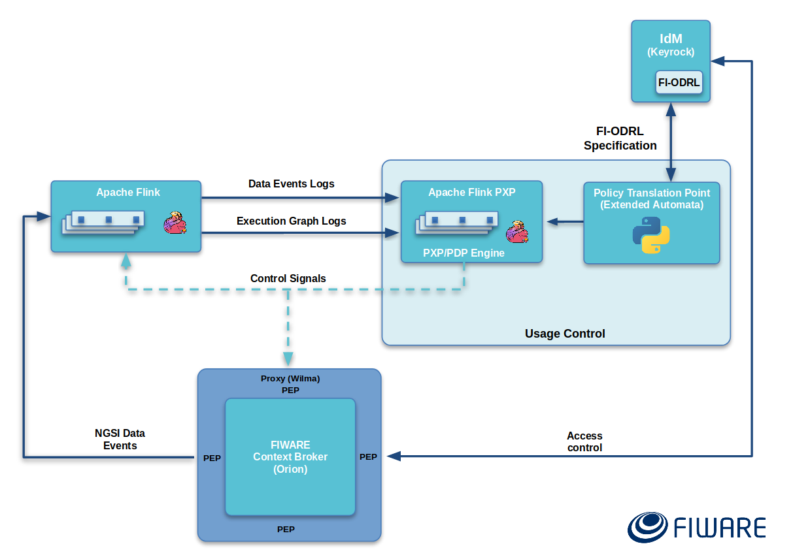

# Fiware Usage Control


[](https://www.fiware.org/developers/catalogue/)

[](http://stackoverflow.com/questions/tagged/fiware)
<br/>
[](https://snyk.io/test/github/ging/fiware-usage-control?targetFile=pom.xml)

Usage control is a promising approach for access control in open, distributed, heterogeneous and network-connected computer environments. 
It encompasses and enhances traditional access control models, Trust Management (TM) and Digital Rights Management (DRM), and its main novelties are mutability of attributes and continuity of access decision evaluation.

Usage control encompasses Data Access control and Data Usage Control, a good representation of this concepts is shown in the next figure:


**Data Access Control:**
 * Specifies who can access what resource
 * Also the rights to access it (actions)

**Data Usage Control:**
 * Ensures data sovereignty
 * Regulates what is allowed to happen with data (future use).
 * Related with data ingestion and processing
 * Context of intellectual property protection, privacy protection, compliance with regulations and digital rights management

This repo includes a set of components and operations for providing usage control capabilities over data coming from the Orion Context Broker, processed by a data streaming processing engine (Apache Flink) through the [FIWARE Cosmos Orion Flink Connector](https://github.com/ging/fiware-cosmos-orion-flink-connector). 
First, the architecture and scenario are presented, followed by the instructions and resources of how you can replicate use case presented.

## Architecture

The next figure presents an abstract representation of the proposed architecture for usage control .
A general overview of the architecture is presented in the next figure. 
This scheme is based on a hybrid model based on *Data Privacy Directive 95/46/EC* and the [IDS reference architecture](https://www.fraunhofer.de/content/dam/zv/de/Forschungsfelder/industrial-data-space/IDS_Referenz_Architecture.pdf) 
and it is divided in three essential parts: Data Provider, Data Consumer and Data Controller.


 
In some cases, the Data Provider and Data Controller can be integrated in a single stakeholder inside the architecture. This is represented in the next figure:


 
## Scenario
A fully-working scenario is provided in this repository, which can be easily modified in order to 
The scenario presented in this repository is composed by:

**Data Consumer:**

 * An **Apache Flink** Cluster (1 Job Manager and 1 Task Manager). This is the processing engine where data consumers upload their job  
 * A **Streaming Job** for making the aggregations and operations of some values of a notified Entity created in the Orion Context Broker

**Data Provider:**

 * One **IDM Keyrock** instance for Access control and define the Usage control Policies
 * One **Orion** (with MongoDB) instance where the entities are created.
 * One **PEP proxy** instance for access control
 * One instance of a **Data Usage Control Panel** web application for monitoring the usage control rules and punishments in real-time
 * One instance of **PTP** (Policy Translation Point) for translating the FI-ODRL Policies into streaming program 
 * One **Apache Flink** instance with complex event processing capabilities (CEP) for analyzing the logs in order to verify the compliance of the obligations defined in the IDM 
 * One instance of a **Supermarket Tickets Dataset** posting data to the Orion Context Broker

 


## Deployment

### Data Provider/Controller
For deploying and running this scenario you need to be pre-installed and running docker and docker compose
1. Clone the repository
```
git clone https://github.com/ging/fiware-usage-control.git
```
2. Go to the root directory
```
cd fiware-usage-control
```
For deploying the Data Usage control components of the Data Provider-Controller side run containers 
defined in the docker-compose.yml file with their respective ENV variables

3. Run containers
```
sudo docker-compose up -d
```
4. Check if all the containers are running
```
sudo docker ps
```
6. Check the orion entities
```
curl localhost:1026/v2/entities -s -S --header 'Accept: application/json' | python -mjson.tool
```
### Data Consumer

Now, for deploying the component on the Data Consumer side, follow the next steps:

1. Go to the `flink` folder
```
cd flink
```
2. Deploy the Flink Cluster
```
sudo docker-compose up -d
```
3. Check if all the containers are running
```
sudo docker ps
```


Once you have everything up and running, you can continue to follow the demo video for the next steps.

[Demo Video](https://drive.google.com/file/d/1o_4KPLG026xG67lXitQeAj98rbZjCGx7/view?usp=sharing) 
