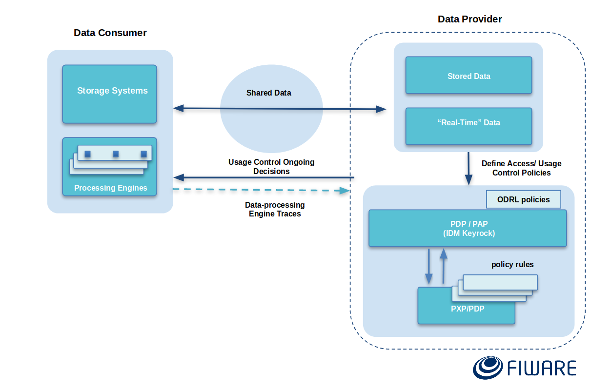
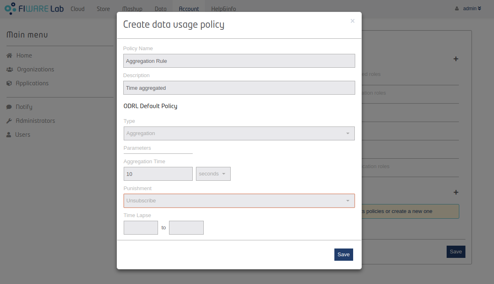

# Fiware Usage Control


[](https://www.fiware.org/developers/catalogue/)

[](http://stackoverflow.com/questions/tagged/fiware)
<br/>
<!--[](https://snyk.io/test/github/ging/fiware-usage-control?targetFile=pom.xml)-->

Usage control is a promising approach for access control in open, distributed, heterogeneous and network-connected computer environments. 
It encompasses and enhances traditional access control models, Trust Management (TM) and Digital Rights Management (DRM), and its main novelties are mutability of attributes and continuity of access decision evaluation.

Usage control encompasses Data Access control and Data Usage Control. A good representation of this concepts is shown in the next figure:


**Data Access Control:**
 * Specifies who can access what resource
 * Also the rights to access it (actions)

**Data Usage Control:**
 * Ensures data sovereignty
 * Regulates what is allowed to happen with data (future use).
 * Related with data ingestion and processing
 * Context of intellectual property protection, privacy protection, compliance with regulations and digital rights management

This repository includes a set of components and operations for providing usage control capabilities over data coming from the Orion Context Broker, processed by a data streaming processing engine (Apache Flink) through the [FIWARE Cosmos Orion Flink Connector](https://github.com/ging/fiware-cosmos-orion-flink-connector). 
First, the architecture and scenario are presented, followed by the instructions and resources of how you can replicate the use case presented.


## Architecture

The next figure presents an abstract representation of the proposed architecture for usage control .
A general overview of the architecture is presented in the next figure. 
This scheme is derived from a hybrid model based on the *[Data Privacy Directive 95/46/EC](https://eur-lex.europa.eu/legal-content/en/TXT/?uri=CELEX%3A31995L0046)* and the *[IDS reference architecture](https://www.fraunhofer.de/content/dam/zv/de/Forschungsfelder/industrial-data-space/IDS_Referenz_Architecture.pdf)* 
and it is divided in three essential parts: Data Provider, Data Consumer and Data Controller.

### Three stakeholders


### Two stakeholders 
In some cases, the Data Provider and Data Controller can be integrated in a single stakeholder inside the architecture. This is represented in the next figure:



The different components that make up this architecture are described in detail below:

**Data Consumer:**

 * **Apache Flink Cluster**: Big Data Processing Engine in which client jobs are run. The data consumer may write real-time data processing jobs using Flink for Scala and the [FIWARE Cosmos Orion Flink Connector](https://github.com/ging/fiware-cosmos-orion-flink-connector) in order to have a direct ingestion of data from Orion in the processing engine. 

**Data Provider/Controller:**

 * **Orion Context Broker**: Component that allows to manage the entire lifecycle of context information
 * **IdM Keyrock**: Component for defining Access and Usage Control Policies
 * **PEP (Policy Enforcement Point) proxy**: Component for enforcing Access Control Policies
 * **PTP (Policy Translation Point)**: Component for translating the FI-ODRL Policies into a program that checks compliance in real time
 * **PXP/PDP (Policy Execution/Decision Point)**: Component with complex event processing capabilities (CEP) for analyzing the logs in order to verify the compliance of the obligations defined in the IDM and enforce the punishments
 
 
## Example use case: Supermarket Store

A fully working scenario is provided in this repository, which can be easily modified in order to fit a different use case.

### Use case description

The use case proposed is based on a supermarket scenario. It consists on a series of stores that post data from each purchase to Orion. The data provider would like to make these data available to customers, only if their use of these data complies with a series of policies that both parties have agreed upon.

#### Data definition
The data involved in this scenario is represented by a Ticket Entity available in Orion. This entity contains purchase information on the specific store (`mall`), the `client`, the `date`, and a list with the purchased `items`. 
Each of these items includes the number of units purchased (`net_am`), the unit price (`net_am`) and the description of the item (`desc`).
A sample entity is presented below:

```json
{
  "id":"ticket",
  "type":"ticket",
  "attrs":{
    "_id":{
      "type":"String",
      "value":1027,
      "metadata":{}
    },
    "items":{
      "type":"object",
      "value":[{
        "net_am":3.9,
        "n_unit":6,
        "desc":"GOURMET  85GR"
      }],
    "metadata":{}
  },
  "mall":{
    "type":"String",
    "value":2,
    "metadata":{}
  },
  "date":{
    "type":"date",
    "value":"01/14/2016",
    "metadata":{}
  },
  "client":{
    "type":"int",
    "value":77021708271,
    "metadata":{}
    }
  }
}
```


#### Defining policies

The policies that the data provider wants to enforce on the data are the following:

 * The user shall **NOT** save the data without aggregating them every 15 seconds first or else the processing job will be terminated
 
 * The user shall **NOT** receive more than 200 notifications from Orion in a minute or else the subscription to the entity will be deleted
 
 
The data provider has to define these policies using the web interface that KeyRock provides. 




When the data provider creates these policies in KeyRock and applies them to a certain user, KeyRock translates them into the FI-ODRL language.
 ```xml
 // TODO
 ```
 
KeyRock notifies the PTP that a new policy has to be enforced. A CEP program is generated from the FI-ODRL policy definition through an extended automata.
The policies defined in this example would turn into the following CEP code excerpt:

```scala
// First pattern: At least N events in T.    
val countPattern2 = Pattern.begin[Entity]("events" )
    .timesOrMore(200).within(Time.seconds(15))
      
CEP.pattern(entityStream, countPattern2).select(events =>
    Signals.createAlert(Policy.COUNT_POLICY, events, Punishment.UNSUBSCRIBE))

// Second pattern: Source -> Sink. Aggregation TimeWindow
val aggregatePattern = Pattern.begin[ExecutionGraph]("start",    
    AfterMatchSkipStrategy.skipPastLastEvent())
      .where(Policies.executionGraphChecker(_, "source"))
      .notFollowedBy("middle").where(Policies.executionGraphChecker(_, "aggregation", 15000))
      .followedBy("end").where(Policies.executionGraphChecker(_, "sink")).timesOrMore(1)

CEP.pattern(operationStream, aggregatePattern).select(events =>
   Signals.createAlert(Policy.AGGREGATION_POLICY, events, Punishment.KILL_JOB))

```

The generated CEP program is deployed and receives the logs from the user processing engine:
 * **Execution Graph Logs**: Chain of operations performed by the data user
 * **Event Logs**: NGSI Events received by the data user coming from Orion
 
#### The data user program

The data user wants to extract value in real-time from the data received. Specifically, he/she is interested in knowing what the average purchase price is for the supermarket clients every hour. 
In order to achieve this, he/she may write a job like such:

```scala
val env = StreamExecutionEnvironment.getExecutionEnvironment

// Create Orion Source. Receive notifications on port 9001
val eventStream = env.addSource(new OrionSource(9001))

// Process event stream
val processedDataStream = eventStream
  .flatMap(event => event.entities)
  .map(entity => {
    val id = entity.attrs("_id").value.toString
    val items =   entity.attrs("items").value.asInstanceOf[List[Map[String,Any]]]
        items.map(product => {
          val productName = product("desc").asInstanceOf[String]
          val unitPrice =  product("net_am").asInstanceOf[Number].floatValue()
          val unitNumber = product("n_unit").asInstanceOf[Number].floatValue()
          SupermarketProduct(id, productName, unitPrice * unitNumber)
        })
      })
      .map(_.map(_.price).sum)
      .timeWindowAll(Time.minutes(60))
      .aggregate(new AverageAggregate)
    // Print the results with a single thread, rather than in parallel
    processedDataStream.print().setParallelism(1)
    env.execute("Supermarket Job")

```
  
This job is deployed on the Flink Client Cluster using the provided web UI.
As soon as the job is deployed, the Execution Graph logs and the NGSI Event logs start to be sent to the PDP/PXP, who verifies that policies are being complied with an enforces punishments if they are not.
  

#### Monitoring policy enforcement

The data provider has to be aware of when data consumers are not complying with the established policies. 
For this task, a control panel is provided in which all the events regarding policies can be checked in real-time, as well as a series of statistics on data usage.


### Deployment
#### Agents involved
The scenario presented in this repository is composed by a series of building blocks which can be easily replicated using the provided docker-compose file. It consists of the following containers:

**Data Consumer:**

 * An **Apache Flink** Cluster (1 Job Manager and 1 Task Manager) 
 * A **Streaming Job** for making the aggregations and operations of some values of a notified Entity created in the Orion Context Broker

**Data Provider/Controller:**
 
 * One **Orion** (with MongoDB) instance 
 * One **IdM Keyrock** instance
 * One **PEP proxy** instance 
 * One **PTP (Policy Translation Point)** instance
 * One **Data Usage Control Panel** web application instance for monitoring the usage control rules and punishments in real-time
 * One **PXP/PDP (Policy Execution/Decision Point)** instance based on Apache Flink 
 * One container with a **supermarket tickets database** posting data to the Orion Context Broker

 


For deploying and running this scenario you need to have docker and docker-compose

1. Clone the repository
```bash
git clone https://github.com/ging/fiware-usage-control.git
```
2. Access the root directory
```bash
cd fiware-usage-control
```

#### Data Provider/Controller
For deploying the Data Usage Control components of the Data Provider-Controller side run containers 
defined in the `docker-compose.yml` file with their respective ENV variables

3. Run containers
```bash
sudo docker-compose up -d
```
4. Check if all the containers are running
```bash
sudo docker ps
```
6. Check the orion entities
```bash
curl localhost:1026/v2/entities -s -S --header 'Accept: application/json' | python -mjson.tool
```
#### Data Consumer

Now, for deploying the component on the Data Consumer side, follow the next steps:

1. Go to the `flink` folder
```bash
cd flink
```
2. Deploy the Flink Cluster
```bash
sudo docker-compose up -d
```
3. Check if all the containers are running
```bash
sudo docker ps
```


Once you have everything up and running, you can go on to follow the demo video for the next steps.

**[Demo Video](https://drive.google.com/file/d/1o_4KPLG026xG67lXitQeAj98rbZjCGx7/view?usp=sharing)**
